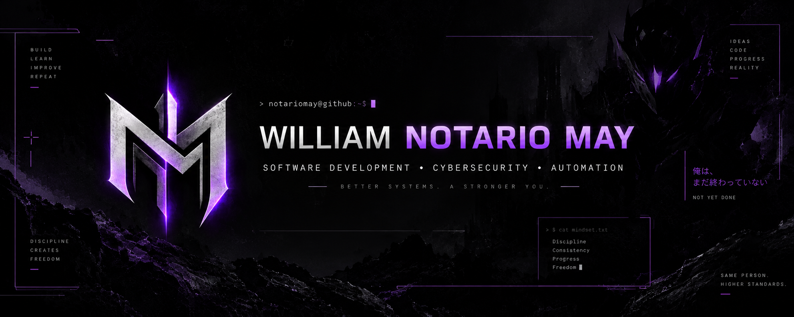

<p align="center">
  
</p>


### Software Developer | Cybersecurity Enthusiast 🛡️

I'm a Computer Systems Engineering professional focused on software development, cybersecurity and building practical projects.

Currently exploring **ethical hacking, automation, web development and cybersecurity**, while developing projects that combine technology with things I'm genuinely interested in.

---

## 🧑‍💻 About Me

- 🛡️ Interested in **Cybersecurity & Ethical Hacking**
- 💻 Building projects with **Python, JavaScript and modern web technologies**
- 🐧 Exploring **Linux, networking and security tools**
- 🗄️ Experience working with **SQL and databases**
- ⚙️ Interested in **automation and AI-assisted development**
- 📚 Currently expanding my cybersecurity knowledge

---

## ⚔️ Featured Project

### 😈 Devil Arc

**Gamified Fitness Tracking Platform**

Devil Arc transforms workout tracking into an RPG-inspired progression system built around consistency, progression and performance.

<p align="center">
  <a href="https://github.com/notariomay/devil-arc">
    
  </a>
</p>

<p align="center">
  <strong>Workout Tracking • XP System • Levels • Ranks • Streaks • Progress Analytics</strong>
</p>

<p align="center">
  <a href="https://github.com/notariomay/devil-arc">
    <strong>⚔️ View Devil Arc Repository</strong>
  </a>
</p>

---

## 🛠️ Tech Stack

### Languages

<p>
  
</p>

### Tools & Databases

<p>
  
</p>

### Cybersecurity & Systems

<p>
  
</p>

**Currently learning:** Cybersecurity • Ethical Hacking • Networking • Web Security

---

## 🎯 Current Focus

```text
> Building Devil Arc
> Learning Cybersecurity
> Developing practical projects
> Improving every commit
```

---

## 📫 Connect with Me

<p align="left">
  <a href="mailto:notariomayow@icloud.com">
    
  </a>

  <a href="https://github.com/notariomay">
    
  </a>
</p>

<p>
  Always building, always learning.
</p>
